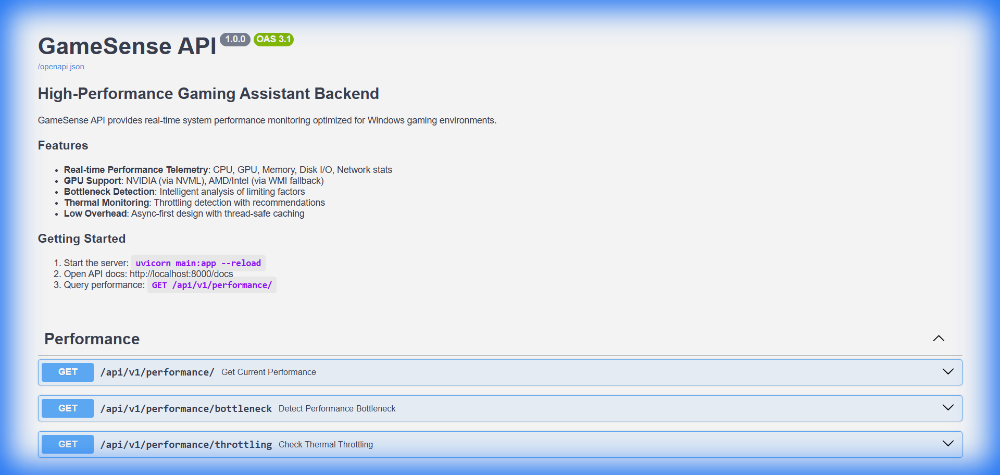
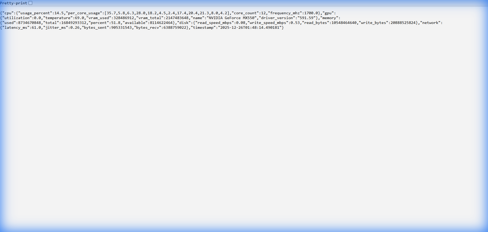

# 🎮 GameSense API 1.0v

<div align="center">


**High-Performance Desktop Gaming Assistant Backend API**

*Real-time performance telemetry, bottleneck detection, and thermal monitoring for Windows gamers*

</div>

---

## ✨ Features

- 🖥️ **Real-time CPU Monitoring** - Per-core usage, frequency, and total utilization
- 🎮 **GPU Telemetry** - NVIDIA support via NVML, AMD/Intel fallback via WMI
- 🌡️ **Thermal Monitoring** - Temperature tracking with throttling detection
- 💾 **Memory Stats** - RAM usage with detailed breakdowns
- 💿 **Disk I/O** - Read/write speeds in real-time
- 🌐 **Network Latency** - Ping and jitter monitoring
- 🔍 **Bottleneck Detection** - Intelligent analysis (CPU-bound, GPU-limited, thermal, etc.)

---

## 📸 Screenshots

### Swagger UI Documentation


### API Response - System Stats


---

## 🚀 Quick Start

### Prerequisites
- Python 3.10+
- Windows 10/11
- NVIDIA GPU (optional, for full GPU telemetry)

### Installation

```bash
# Clone the repository
git clone https://github.com/mohammad-emad9/GameSense-API.git
cd GameSense-API

# Install dependencies
pip install -r requirements.txt

# Start the server
python -m uvicorn main:app --host 127.0.0.1 --port 8000
```

### Access the API
- **Swagger UI**: http://127.0.0.1:8000/docs
- **ReDoc**: http://127.0.0.1:8000/redoc
- **API Root**: http://127.0.0.1:8000/

---

## 📡 API Endpoints

### Performance Endpoints
| Endpoint | Method | Description |
|----------|--------|-------------|
| `/api/v1/performance/` | GET | Get current system performance stats |
| `/api/v1/performance/bottleneck` | GET | Detect performance bottleneck |
| `/api/v1/performance/throttling` | GET | Check thermal throttling status |

### Game Detection Endpoints
| Endpoint | Method | Description |
|----------|--------|-------------|
| `/api/v1/game/` | GET | Get active game context |
| `/api/v1/game/adapters` | GET | List all registered game adapters |
| `/api/v1/game/running` | GET | Get list of running games |
| `/api/v1/game/{game_id}` | GET | Get specific game context |
| `/api/v1/game/{game_id}/info` | GET | Get adapter info |
| `/api/v1/game/{game_id}/running` | GET | Check if specific game is running |

### System Endpoints
| Endpoint | Method | Description |
|----------|--------|-------------|
| `/health` | GET | Health check endpoint |

### Example Response

```json
{
  "cpu": {
    "usage_percent": 30.9,
    "per_core_usage": [25.0, 35.0, 28.0, ...],
    "core_count": 12,
    "frequency_mhz": 1700.0
  },
  "gpu": {
    "utilization": 15.0,
    "temperature": 69.0,
    "vram_used": 322122752,
    "vram_total": 2147483648,
    "name": "NVIDIA GeForce MX550"
  },
  "memory": {
    "used": 8589934592,
    "total": 17179869184,
    "percent": 50.0
  },
  "disk": {
    "read_speed_mbps": 0.4,
    "write_speed_mbps": 0.6
  },
  "network": {
    "latency_ms": 25.0,
    "jitter_ms": 3.5
  }
}
```

---

## 🏗️ Project Structure

```
gamesense_api/
├── main.py                  # FastAPI entry point
├── requirements.txt         # Dependencies
├── adapters/                # Game adapter plugins
│   ├── base.py              # Base adapter class
│   ├── registry.py          # Adapter discovery & registration
│   ├── games/
│   │   ├── cs2.py           # Counter-Strike 2 adapter
│   │   └── gta5.py          # GTA V adapter
│   └── strategies/
│       ├── log_reader.py    # Log file telemetry strategy
│       └── window_observer.py  # Window title strategy
├── models/
│   ├── game.py              # Game context models
│   └── performance.py       # Performance metrics models
├── core/
│   ├── game_detector.py     # Game process detection
│   ├── game_service.py      # Game telemetry service
│   └── performance_monitor.py  # System monitoring service
├── api/
│   └── endpoints/
│       ├── game.py          # Game API endpoints
│       └── performance.py   # Performance API endpoints
├── app/
│   └── lifespan.py          # Startup/shutdown lifecycle
└── docs/
    └── README.md
```

---

## 🔧 Technical Highlights

- **Async-First Design** - Non-blocking I/O using `asyncio` and thread pool executors
- **Thread-Safe Caching** - `asyncio.Lock` for safe concurrent access
- **GPU Backend Detection** - Automatic NVML/WMI selection
- **Graceful Degradation** - Returns sane defaults on hardware failures
- **Structured Logging** - JSON-formatted logs with component tags
- **Dependency Injection** - Clean, testable architecture
- **Extensible Adapter System** - Easy to add new game adapters

---

## 📋 Requirements

```
fastapi>=0.104.0
uvicorn[standard]>=0.24.0
pydantic>=2.5.0
psutil>=5.9.0
pynvml>=11.5.0
wmi>=1.5.1
pywin32>=306
```

---

## 🛣️ Roadmap

- [x] Game adapter plugins (CS2, GTA V)
- [x] Game state awareness
- [ ] Voice command ingestion
- [ ] Dynamic overlay control
- [ ] Performance optimization recommendations

---

## 📄 License

MIT License - See [LICENSE](LICENSE) for details.

---

<div align="center">

**Built with ❤️ for gamers**

</div>
